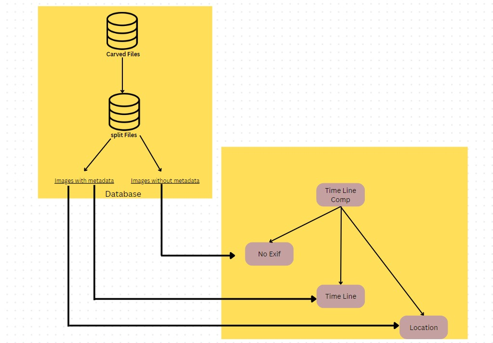
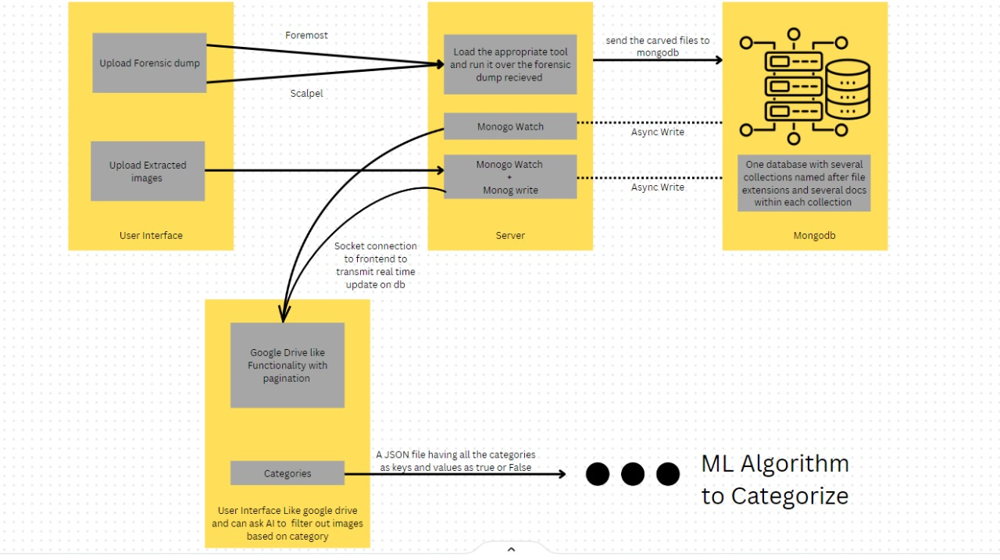

# Segregation-and-analysis-of-multimedia (Cyber Forensic Tool)
This cyber forensic tool was developed by our team during an internship at the Center for Cybercrime Training and Reasarch at CID, Government of Karnataka. 
It is designed to assist forensic investigators in analyzing and categorizing images extracted from forensic dumps. The tool is open-source and available for further development and use.
The project is a web-based tool that supports forensic dump formats like E01, RAW, and DD. It utilizes image carving tools such as Scalpel and Foremost to extract images and categorizes them using machine learning models. The tool enables investigators to search for similar faces and create timelines based on metadata to aid in digital investigations.
## Features
- Forensic Dump Support: Supports processing of forensic dumps in E01, RAW, and DD formats.
- Image Carving: Extracts images and photos from forensic dumps using Scalpel and Foremost.
- Image Categorization: Uses machine learning to classify images into user-defined categories, such as narcotics, weapons, and more.
- Search Faces by Image: Find similar faces in the database by dragging and dropping a sample photo.
- Timeline View: Separates images based on the availability of metadata and organizes them into categories. The tool plots a traced route of images with location data (latitude and longitude) from specified date ranges.
  


In the location category, the tool plots the traced route of all the images between a range of start datetime and end datetime, having Location info in metadata (GPSInfo, specifically).

## Brief Architecture
The following image shows the brief architecture of the tool 



### Upload Options:
- Forensic Dump Upload: Supports various forensic dump formats, with an option to choose the preferred extraction tool.
- Image Upload: Allows users to directly upload images for analysis.
- The images uploaded in either manner are processed and written into MongoDB asynchronously and the frontend is updated in realtime using web sockets. 

### Processing and Storage:
- All data is processed and stored asynchronously in MongoDB.
- Real-time updates are provided to the frontend using WebSockets.

### UI and Categorization:
- The UI resembles Google Drive, providing a user-friendly interface for managing and categorizing images.
- A checklist is provided to select predefined categories for image classification.

## Categories covered: 
-   Flags
-   Food
-   Jewelry
-   Maps
-   Credit cards
-   Money
-   Faces
-   Gatherings
-   Handheld objects
-   Nudity
-   Tattoos
-   Beach
-   Hotel rooms
-   Pool
-   Restaurant
-   Cigarettes
-   Drugs
-   Camera
-   Smartphones
-   Barcodes and QR codes
-   Documents
-   Handwriting
-   Invoices
-   Photo IDs
-   Cars
-   License plates
-   Motorcycles
-   Vehicle dashboards
-   Fire and Explosion
-   Weapons

## Project Structure

The project consists of two main folders:

- **frontend**: Contains the React application for the user interface. Refer to the README.md in the frontend folder for setup and usage instructions.
- **backend**: Contains the backend code, which is designed to run on Windows with WSL installed. Refer to the README.md in the backend folder for setup and usage instructions.

## Requirements

### Backend

- Windows OS with WSL installed
- Python 3.9.13
- Required Python packages (listed in `requirements.txt`)

### Frontend

- Node.js v16.17.0
- npm 8.15.0

## Installation

1. Clone the repository:
   ```bash
   git clone https://github.com/Tejasakumar/Segregation-and-analysis-of-multimedia.git
   ```
2. Navigate into the directory:
   ```bash
   cd Segregation-and-analysis-of-multimedia
    ```
Start the frontend and backend services in separate terminals as instructed in their respective README.md files (frontend/README.md and backend/README.md).


# Credits
1. [Roboflow-datasets](https://universe.roboflow.com/)
2. [Ultralytics-yolov8](https://docs.ultralytics.com/)
3. [Ollama](https://github.com/ollama/ollama)
4. [Llava](https://llava-vl.github.io/)
5. [NudeNet](https://github.com/notAI-tech/NudeNet)
6. [Dlib](https://pypi.org/project/dlib/)
7. [face_recognition](https://pypi.org/project/face-recognition/)